## Introduction
When running VM’s in the cloud you need to consider cost as part of your lab.  
And since running compute in Azure and AWS could be costly when you need to run your ADFS, AD Connect, AD and SQL etc 24/7, it’s still practical to have a lab on-prem. This article will go through the steps on how you can get your hybrid lab up and running with site-2-site VPN tunnel to Azure using pfSense.

First, we need to plan our Azure site-to-site VPN requirements for Azure.  
The table below shows that the Azure basic sku which cover most needs for a test/dev lab.

Check the latest documentation on Azure vpn gateways if you would like to go into the details.  
<https://docs.microsoft.com/en-us/azure/vpn-gateway/vpn-gateway-about-vpngateways>

| SKU | S2S/VNet-to-VNet Tunnels | P2S Connections | Aggregate Throughput Benchmark
| :------: | :-----------: | :------: | :-----------: |
| VpnGw1 | Max. 30 | Max. 128 | 650 Mbps |
| VpnGw2 | Max. 30 | Max. 128 | 1 Gbps   |
| VpnGw3 | Max. 30 | Max. 128 | 1.25 Gbps|
| Basic  | Max. 10 | Max. 128 | 100 Mbps |

In regards to having only dynamic IP at my Homelab, we can automate this task using Azure Automation
I’m using the script from http://www.deployazure.com/management/automation/azure-automation-update-vpn-local-network-gateway/

in the picture below, I have created a generic design to show the connection from on-prem to Azure or AWS.
For the purpose of this specific guide, I will only show how to connect to Azure. Will cover AWS in another guide 🙂

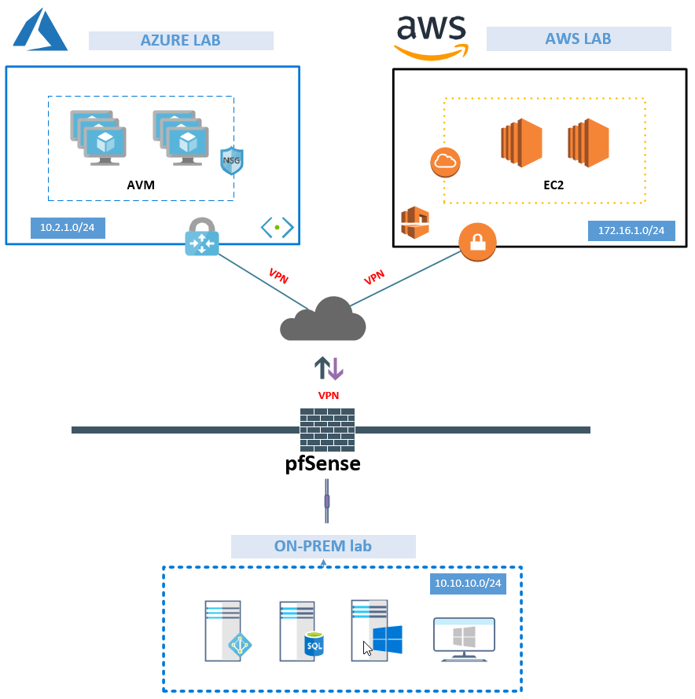

# Steps

* Create Resource group – Azure
* Create virtual network – Azure
* Create virtual network gateway – Azure
* Create local network gateway – Azure
* Add VPN tunnel – pfSense
* Iperf VPN speed test

### Step 1 – Create Resource group – Azure
To keep things tidy we are going to have a dedicated resource group for all the vpn resources.

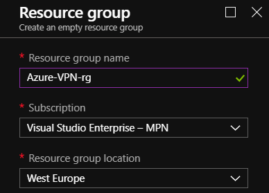

### Step 2 – Create a virtual network  – Azure

Add your Address space, Subnet and Address IP range to create the virtual network

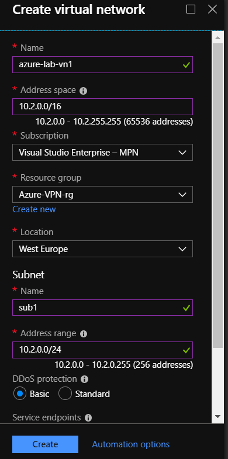

### Step 3 – Create virtual network gateway – Azure
We will use Route-based, Basic SKU, Virtual Network and create the new public address of our virtual network gateway.

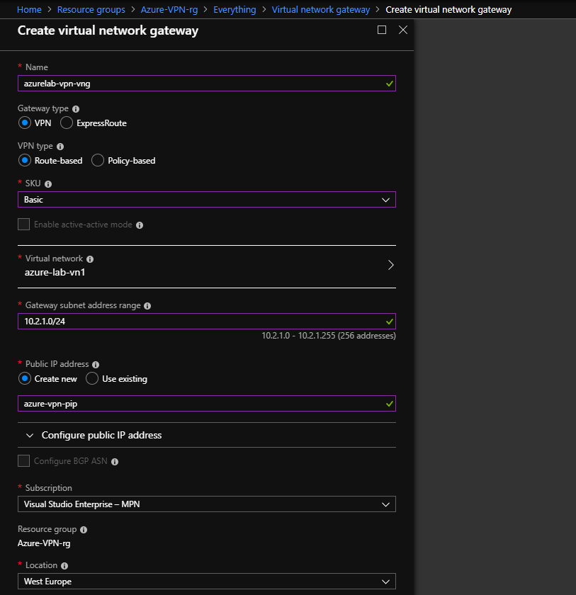

When we choose to create the virtual network gateway which will kick off our deployment.
This takes exactly 30 min. Yes, exactly spot on 30 min.

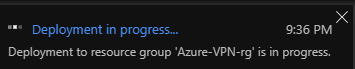

### Step 4 – Create local network gateway – Azure

When you create local network gateway you must add your WAN/ISP public IP.
Add the Address space of your local address space from the pfSense lab network.

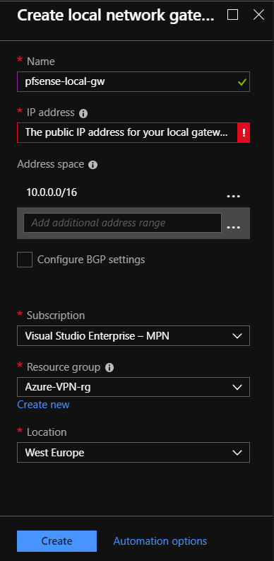

To link things together we must Add the Connections from virtual network gateway and local network gateway.

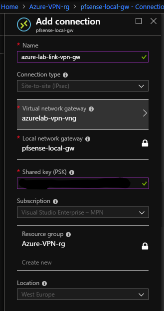

To find the Public IP of your Virtual network gateway go to the overview.

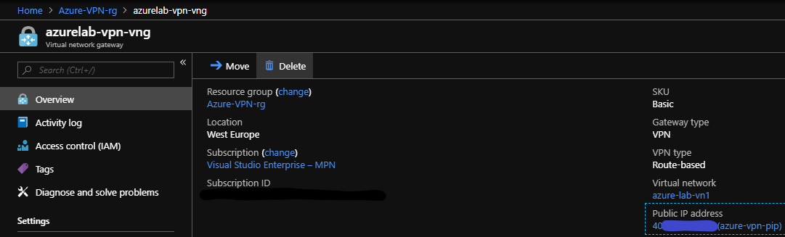

### Step 5 – Add VPN tunnel – pfSense

Go to VPN to add the Tunnel and Add P1 to kick of the wizard.

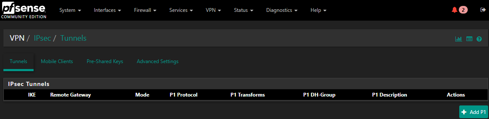

Add the public IP of your Azure virtual network gateway and give it a proper description.

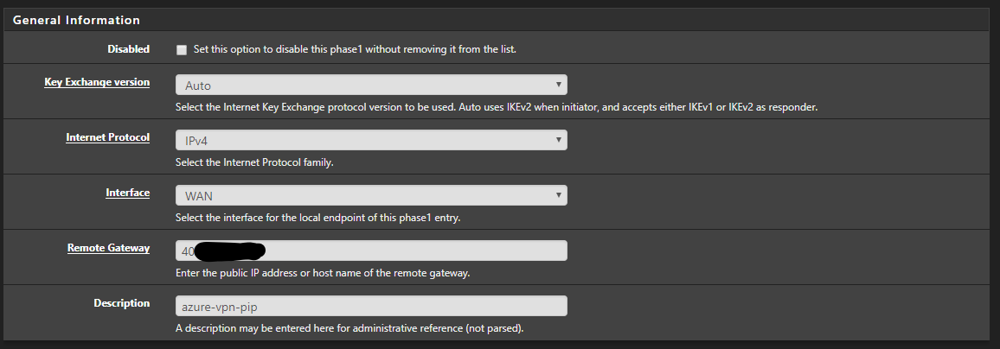

Add your VPN Pre-shared key.

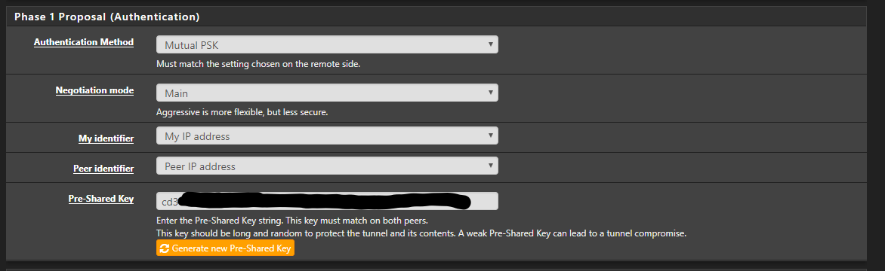

Set the required Encryption settings and change the Lifetime.

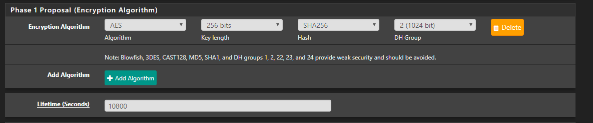

Next, we need to add SA/Key Exchange and Add P2, to add the required settings.

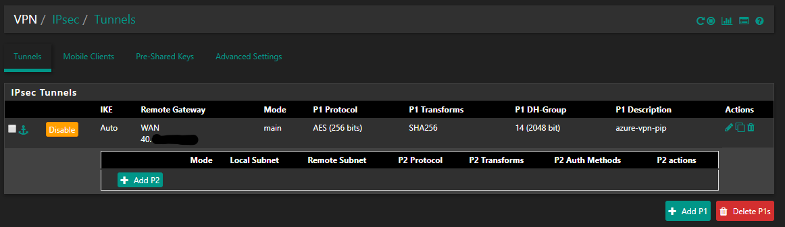

Change the required Encryption and hash Algorithms and save your settings.

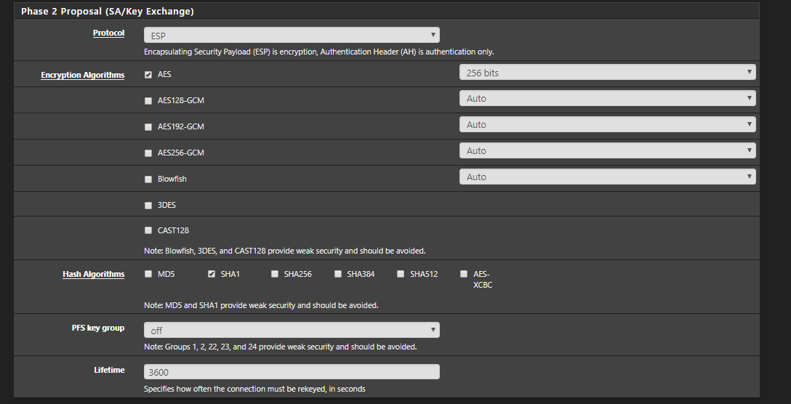

Next we need to create the IPsec firewalls in pfSense.  Go to Firewall – Rules – IPsec and ADD.  I recommend allowing all traffic first, and then locking down the firewall ruleset when you are finished with the setup.

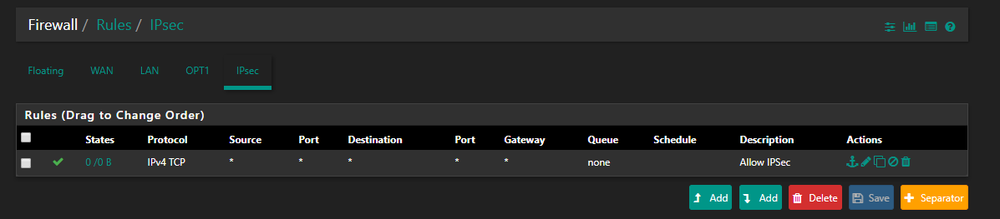

We can monitor the IPsec overview to verify that we have Established our connections from both pfSense and Azure.

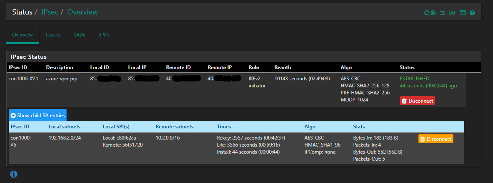

In azure we can get a Overview from Data in/out.

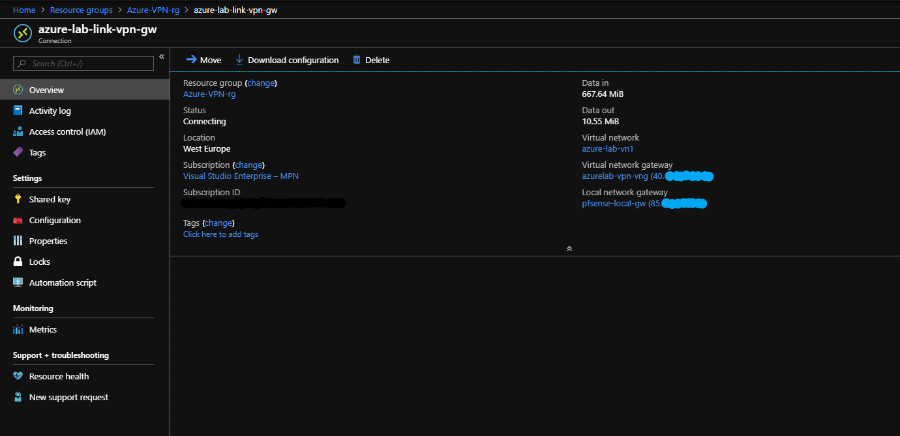


### Step 6 – Iperf VPN speed test

Now you can test RDP connection to the Azure VM. If you RDP isn’t working, check your NSG in Azure to see that your ruleset allows RDP.

When connected we want to verify that we are getting the expected speed. Install iperf on the Azure VM and run command.

```Command
iperf3.exe -s -p 5001
```

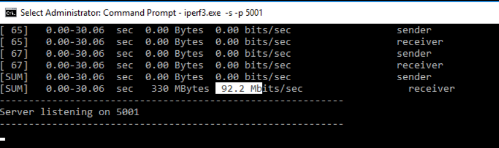

On the on-prem server install iperf run the command

```Command
iperf3.exe -c "Azure VM IP" -t 30 -p 5001 -P 32
```

## summary


I can now conclude that I get the performance as expected from the basic SKU, and my fiber connection is limited to 100 anyway 🙂

