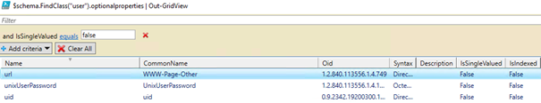

### Introduction

I was working with a use case on adding multi-value attributes for dynamic groups in Azure AD. I started off looking for on-prem AD attributes we could use for the multi-value string. To find these attributes I start PowerShell to get the AD Schema loaded. 

```Command
$schema =[DirectoryServices.ActiveDirectory.ActiveDirectorySchema]::GetCurrentSchema
```


Next step was to add which optional attributes (muli-value) that I could use for testing. To filter the attributes I use the Powershell command below.

```
$schema.FindClass("user").optionalproperties | Out-GridView
```
I set filter is, IsSingleValued (multi-value) to False. Just as part of the demo I selected URL as the attribute.



I added values to the URL attribute and changed AD Connect Directory extensions attributes and on AD Connect I start deltasync with 

```
Start-ADSyncSyncCycle -PolicyType Delta 
```

When looking into the AD Connect Metaverse Connectors I could see that the changed was applied and attribute was added, but AAD did not show any changes. I first verified that the AzureADApplicationExtensionProperty actually had synced to AAD and I could confirm this was added with the AAD Powershell command below.  


```Get-AzureADApplication | 
Get-AzureADApplicationExtensionProperty
```


To verify the values on the User object I checked the AAD extension property with the AAD PowerShell command below.  


```
Get-AzureADUser -ObjectId $UserId | Select -ExpandProperty ExtensionProperty
```


### Summary

However, I could not find any values as marked in yellow question mark above. Since I could not find any values I started testing some other Multi-value Attributes and synched them to AAD. But still, I could not get this scenario to work. 

So after some troubleshooting, I found this article  
<https://feedback.azure.com/forums/169401-azure-active-directory/suggestions/32622497-support-for-multi-valued-attributes-synchronized-f> in the feedback section at Azure. 

As my gut feeling expected, I could see that the Azure AD team confirms that Multi-Value is not supported yet.