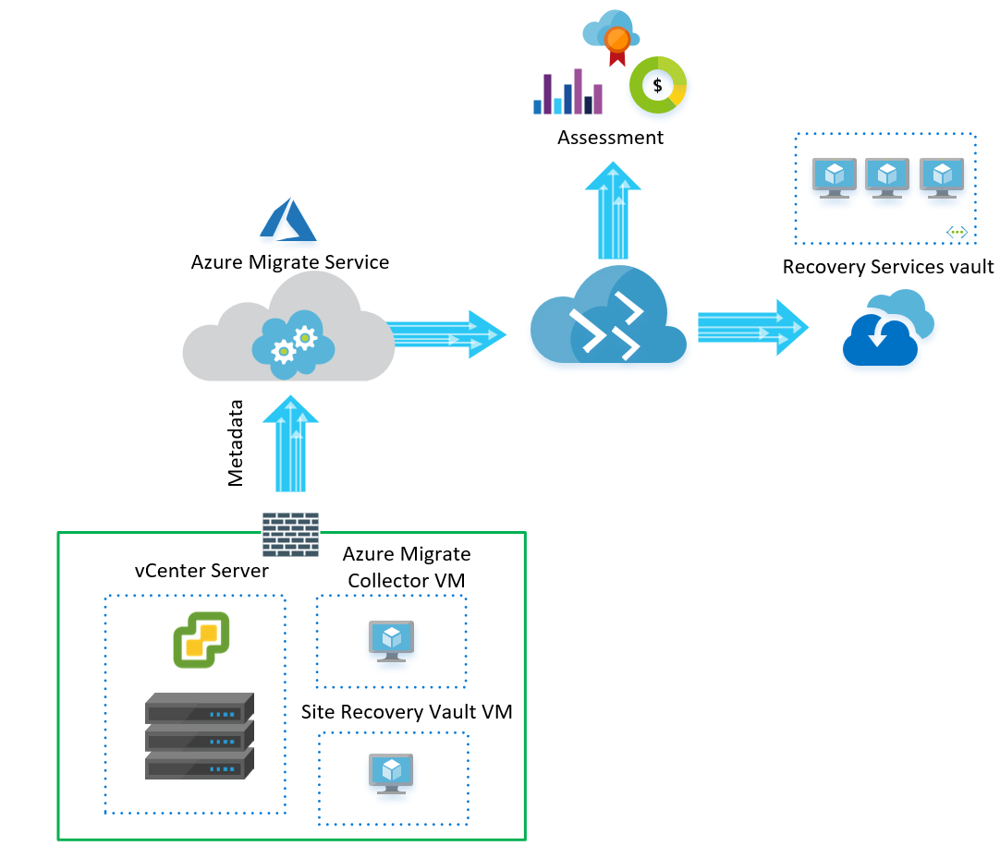

I have been following the development of Azure Migrate since my first trip to Ignite in 2017,&nbsp;and have been looking forward to getting this to EU regions, but I have been waiting with patience 🙂 

The first time I thought Microsoft was to release Azure Migrate for EU Regions, was back in TechSummit in Paris, March 2018. The release would have been a perfect fit since Microsoft was going to release new Azure data center France regions. 

The TechSummit session started with a French guest speaker and I did not understand much off. This reminded me that I should have definitely spent some more time back at my French class at High School 😯

After a while, Ananthanarayan Sundaram from Microsoft continued the show in English, and I waited excited for the news. Waited and waited, but still no news about release date… However almost 1 year later 16.01.2019 Azure Migrate became available in Europe, and this was a welcome addition. 

I have been looking into Azure Migrate for Assesment for rehost, replat form and refactor strategy. I think Azure Migrate has is place in the market for SMBs running vCenter on-prem and are looking for a Lift and Shift for IaaS,</ before they can go Cloud-Native with their applications. I’m still a true believer of rearchitecting and rebuilding for Cloud-Native however there is just use cases where of moving away from the on-prem is needed. 

In this article, I will try to explain how Azure Migrate and Azure Recovery Service Vault could work together. 

**Azure Migrate Quick FAQs**

  * Discovery of Host/Cluster/Folder in vCenter
  * Appliance-based or Agent-based discovery
  * Collects metadata like ( IP,MAC,OS,CPU,Memory, Disk,NICs)
  * Assessment (Shows total cost of ownership and show Azure readiness of VM&#8217;s)
  * Groups (logical grouping of servers that have dependencies)
  * Topology Viewer ( requires Agent for Agent-based discovery ) 

**Azure Site Recovery Quick FAQs**

  * Backup Service for VMs ( Protects all configurations of Azure VMs)
  * Replicate Service for VMs from on-prem (hyper-v, physical or VMware to Azure
  * Recovery Service ( Restore, Replicate of IaaS VMs)

#### Azure Migrate and Azure Site Recovery steps {.wp-block-heading}

  1. Create Azure Migrate Project
  2. Create Recovery Service Vault

**Step 1 ) Create Azure Migrate Project**

Search for Azure Migrate in the Azure Portal and Create your first project. 

Copy your Project credentials like the ID and KEY, because we need these for Connecting VM to the correct Azure Migrate Project.

Download the .Ova File and Upload the OVA to your vCenter host and Deploy OVF Template

Start the Wizard and add your vCenter and migration project  
details.

In the Azure Migrate Project Machines will appear one by one (takes about 15 min to 60 min). In Machine view, you have tabs that show you how you easily can create Assessment Reports and Group Machines to logical groups.

If you need more details for Dependencies, you must install the Microsoft Monitoring Agent (MMA) and dependency agent on your On-Prem VMs and Connect them to an OMS Workspace. 

**Step 2 ) Create the Site Recovery Vault**

Search for Recovery Service Vaults and create your Vault.

Go Trough the steps to prepare Infrastructure.  
In the Wizard Download and Deploy the OVA file for site recovery Configuration Server on your Vcenter server. Follow much of the same steps above regarding deploying the OVA.  
  
Configure a Replication Policy to associate it with ASR

**Test the Migration to Azure**

Go to the Azure Site Recovery (ASR) and replicate your first Test VM. 

**Wrap up**

However, the lack of EU regions has been a showstopper for a while, mostly because of GDPR and EU customers don&#8217;t want to send valuable/sensitive metadata (even though is encrypted at rest & transit). I think the Azure Migrate EU regions, and a combination of Migrate and Azure Site Recovery, can be great tools enabling this type of Cloud Migration Phase. 

[**Azure Migrate**][1] has its limitations, and If this could not be solved you could look into Cloudamize or Turbonomic. Cloudamize and Turbonomic have been the best contenders, and is probably one of the best tools if you need to have more advanced reporting and have a clear Multi-cloud strategy.

 [1]: https://docs.microsoft.com/en-us/azure/migrate/migrate-overview