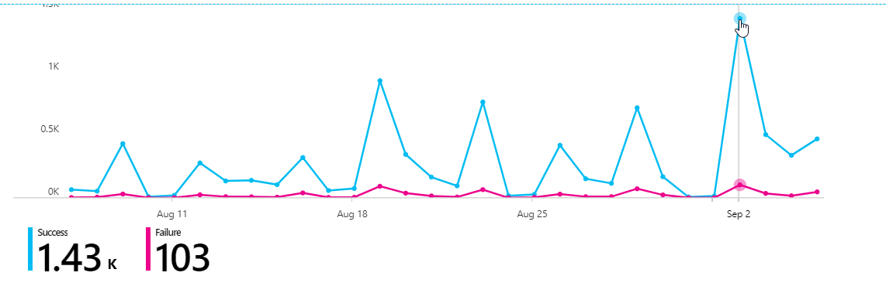

### introduction
I had some trouble with an Azure AD integration with a 3.party SAML application. The users got Azure AD prompt, with the error below: 

Related to the failed login screen below, most logins were successful and looking into the user getting failure, the problem could first seem like it was related to pilot users (including myself of course 🙂 ) with passwordless, since the application had not been changed the last 13 months. I started digging more into the SAML request and did see _Password,ProtectedTransport_ like the error above.  

I checked out the AADSTS75011 at the <https://docs.microsoft.com/en-us/azure/active-directory/develop/reference-aadsts-error-codes> , to see if there were more details about the error 

:large_blue_circle: Blue color = Success logins  
:red_circle: Pink color = Failure

I also had dialog with the 3.party application vendor. We verified that there were not any changes done with the SAML library or Claims, before I started sending the SAML logs.  
  
In parallel, I also created a support ticket to Microsoft , and for my first time tested to use the Enable advanced diagnostics  
  
This functionality is basically pretty genius since you have a Request and Correlation ID, so that Microsoft can look into the authentication request with details about the authentication request. 

After they looked into the ticket, I got the answer that with some additional details that I was unfamiliar with, even though I have been working with multiple SAMl setups for some years


A **tip** banner


PasswordProtectedTransport is not a supported value in Azure AD and also optional for the SAML Request. If there is no specific need for it, the application vendor can remove the value from the SAML Request._  
  
More details at the link:

<https://docs.microsoft.com/en-us/azure/active-directory/develop/single-sign-on-saml-protocol#authnrequest>

The 3.party vendor changed the SAML request, and as expected the SAML SSO worked like a charm again! Thats it for this short post