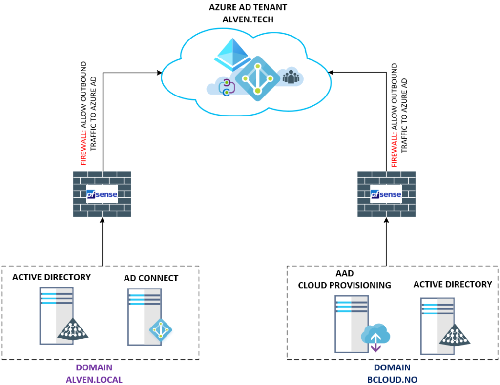



In this post, we will cover the **Azure AD Connect cloud provisioning** (**preview)** released in November 2019. The **Cloud provisioning** is an Agent that can bridge between on-prem and Azure AD to sync users. I don&#8217;t see cloud provisioning as a replacement for AD Connect, but more like simplifying the way to configure user provisioning, across more complex setups with multiple or disconnected forests. Trying to achieve this earlier with AD Connect, requires a complex setup dependent on AD Trust. The **Azure AD Connect cloud provisioning** is much similar functionality Okta has had for some time, so my best guess is that Microsoft move is to gap the missing functionality. The tool will most likely get more features throughout 2020 🙂  
  
My goal with this post is, to cover the use case of the **Azure AD Connect cloud provisioning** with an existing forest and a new forest with a Single Azure AD Tenant. Below is a high-level design, this shows my current setup. To the left, we have my domain that uses AD Connect and the disconnected forests to the right, which uses Azure AD Connect cloud provisioning. Both will sync to the single Azure AD Tenant. There is no site-to-site VPN or any Active Directory Trust between these Forests. 

### Step 1 &#8211; Enable **Azure AD Connect cloud provisioning**  {.wp-block-heading}

The first step to enable Azure AD Connect cloud provisioning is getting the agent from Azure AD 

* https://portal.azure.com/#blade/Microsoft\_AAD\_IAM/ActiveDirectoryMenuBlade/AzureADConnect][1]  
<figure class="wp-block-image size-large is-resized">

 </figure> 

Choose &#8220;**Manage provisioning**&#8221; in the Azure AD Connect cloud provisioning. 

Go to Download Agents, to download  
&#8220;**AADConnectProvisioningAgentSetup.exe** &#8220;agent.  
In terms of HA with cloud provisioning, just install more agents split on other servers per forest. <figure class="wp-block-image size-large is-resized">

 </figure> 

Run the &#8220;**AADConnectProvisioningAgentSetup.exe**&#8221; to complete the setup. The agent requires authentication against Azure AD. <figure class="wp-block-image size-large is-resized">

 </figure> 

When adding privileges to the Domain, use a service account that does not have password change requirement, because changing the password will break the agent. This will require the agent to be reconfigured for the Add the Active Directory, with domain admin privileges. <figure class="wp-block-image size-large is-resized">

 </figure> <figure class="wp-block-image size-large"></figure> 

After the installation, the service will run 2 services **Microsoft Azure AD Connect Agent Updater** and **Microsoft Azure AD Connect Provisioning Agent**. There nothing much we can change after the agent has been installed.<figure class="wp-block-image size-large is-resized">

 </figure> 

We can go back to Azure AD and configure the agent.  
[https://portal.azure.com/#blade/Microsoft\_AAD\_IAM/ActiveDirectoryMenuBlade/AzureADConnect][1] &#8211; Choose Manage Provisioning. <figure class="wp-block-image size-large is-resized">

 </figure> 

It has automaticly popluated the domain field from the Agent I installed.  
The Scope Users give us 3 opportunities. All Users, Selected Security Group and Selected Organizational Units. I&#8217;m using the OU based on this demo environment. you can add multiple OU&#8217;s, but not combine with example OU and Security groups form my testing. <figure class="wp-block-image size-large">

 </figure> <figure class="wp-block-image size-large"></figure> 

The last part at step 4 Deploy, can choose the enable switch.  
The provisioning configuration to users and groups.  
<figure class="wp-block-image size-large is-resized">

 </figure> 

After saving we should see our configuration in the console. <figure class="wp-block-image size-large is-resized">

 </figure> 

The test users synced pretty instant.  
  
Looking into the user attributes with Powershell, we see the details about on-prem AD details. 

  

    <pre class="wp-block-code"><code>Get-AzureADUser -ObjectId $UserId | Select -ExpandProperty ExtensionProperty</code></pre>
  

<figure class="wp-block-image size-large is-resized">

 </figure> 

Verifying Azure AD signing with PHS works aswell. <figure class="wp-block-image size-large is-resized">

 </figure> <figure class="wp-block-image size-large is-resized"></figure> 

### Summary {.wp-block-heading}

The Azure AD Connect cloud provisioning feature is a step in the right direction for Microsoft to fill the missing gap against their competitors, and the use case is absolutely something I will consider for disconnected on-premises Environments. But this will depend highly on what functionality is required and if the environment is not to complex.  
  
The table from Microsoft documentation <https://docs.microsoft.com/en-us/azure/active-directory/cloud-provisioning/what-is-cloud-provisioning?> is great to compare features between **Azure Active Directory Connect sync** vs **Azure Active Directory Connect cloud provisioning**.  
The comparison will help to determine which use case you could fit.  
  
**I will try to update this post as these features go away from the preview.**  

Recommended Links for further documentation from Microsoft : 

<https://docs.microsoft.com/en-us/azure/active-directory/cloud-provisioning/tutorial-single-forest>  
  
<https://docs.microsoft.com/en-us/azure/active-directory/cloud-provisioning/tutorial-existing-forest>

 [1]: https://portal.azure.com/#blade/Microsoft_AAD_IAM/ActiveDirectoryMenuBlade/AzureADConnect